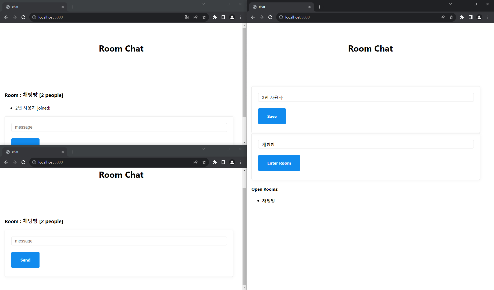
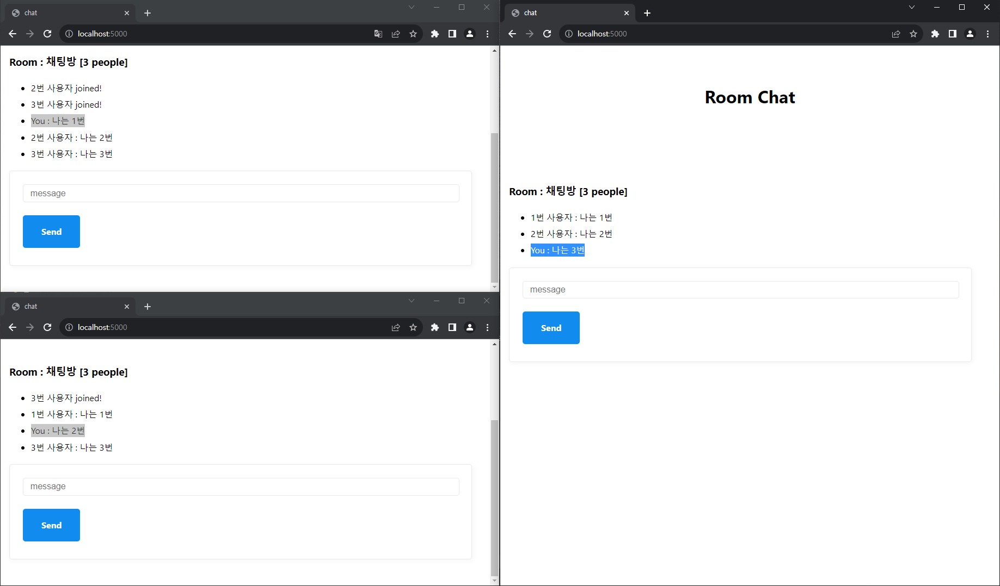
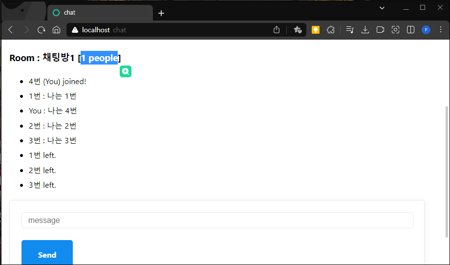
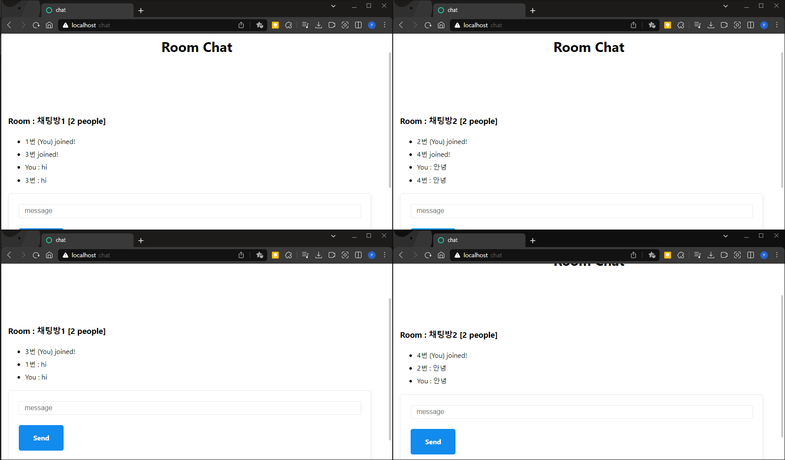
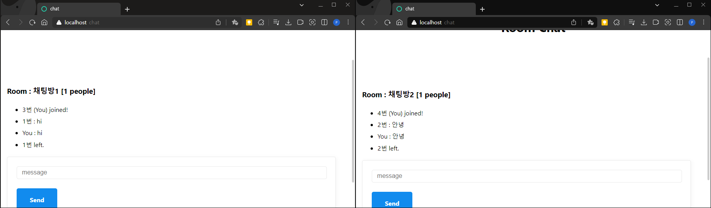

# Socket.IO
자바스크립트로 서버와 클라이언트를 세팅하고 실시간 채팅을 구현

# 개발환경
- Node.JS
  - express, babel, nodemon, pug
- Socket.IO

# Socket.IO(WebSocket)
- 웹 환경에서 하나의 연결을 통해 서버와 클라이언트간 양방향 통신을 제공하는 라이브러리
- 최초 http 통신으로 Socket 생성 후 생성된 Socket으로 실시간 무제한 양방향 통신

# 실행 화면
### 같은 방에 있을 때

ㄴ 채팅방에 있는 1번과 채팅방 목록을 확인하고 입장하는 2번, 3번, 4번

ㄴ 채팅방 내에서 상대방과 채팅을 주고받는 모습, 본인의 채팅은 You로 표시

ㄴ 사용자가 방을 나가고 나갈때마다 인원수 갱신

### 다른 방에 있을 때

ㄴ 1번과 3번이 채팅방1, 2번과 4번이 채팅방2에 있을 때

ㄴ 각 방이 분리되어 다른 채팅을 주고받는 모습

# 느낀 점
- 인터넷 방송이나 유튜브 실시간 방송에 사용되는 채팅방이 어떤 구조로 이루어져있고 어떻게 데이터를 주고 받는지 알 수 있었다.
- socket.on, socket.emit 이벤트가 서버와 클라이언트에서 공통적으로 사용된다는 점이 흥미로웠다.
- Websocket과 Socket.IO를 비교했을 때 Room, Admin UI, Automatic reconnection, HTTP long-polling fallback 등 여러가지 기능을 기본적으로 제공하는 Socket.IO가 더 좋아보였다.
