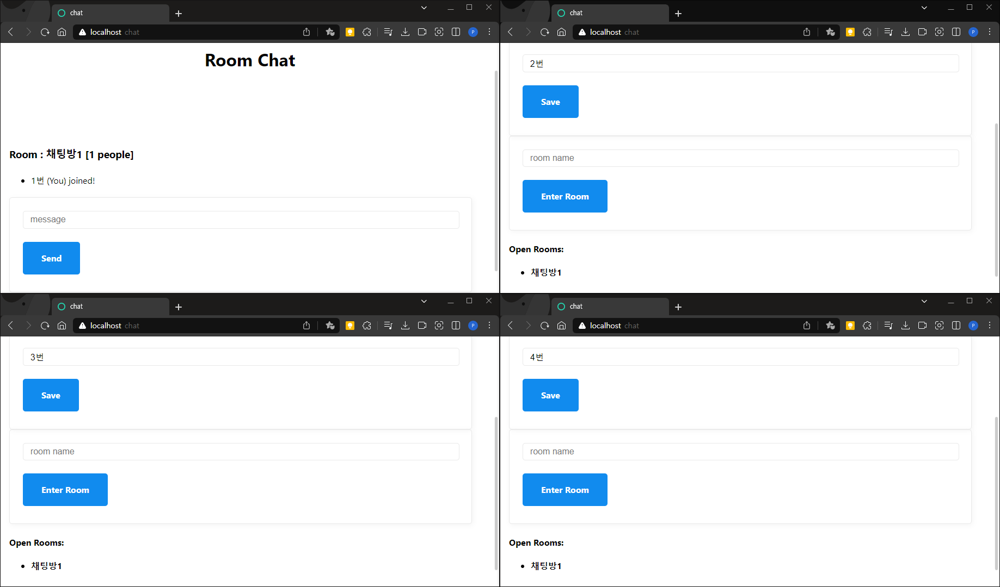
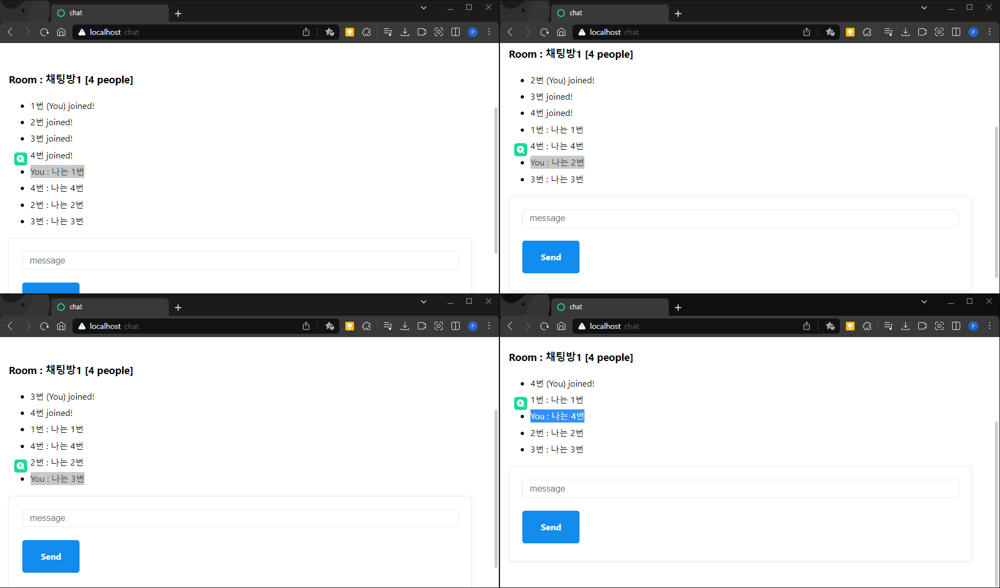

# socketIO
자바스크립트로 서버와 클라이언트를 세팅하고 실시간 채팅을 구현

# 개발환경
- Node.JS
  - express, babel, nodemon, pug
- Socket.IO

# Socket.IO(WebSocket)
- 웹 환경에서 하나의 연결을 통해 서버와 클라이언트간 양방향 통신을 제공하는 라이브러리
- 최초 http 통신으로 Socket 생성 후 생성된 Socket으로 실시간 무제한 양방향 통신

# 실행 화면

채팅방에 있는 1번, 2번 사용자와 채팅방 목록을 확인하고 입장하는 3번 사용자

채팅이 송수신 되는 모습, 본인의 채팅은 You로 표기

2번 ,3번 사용자가 방을 나가고 나갈때마다 새로고침되는 방 인원 수
